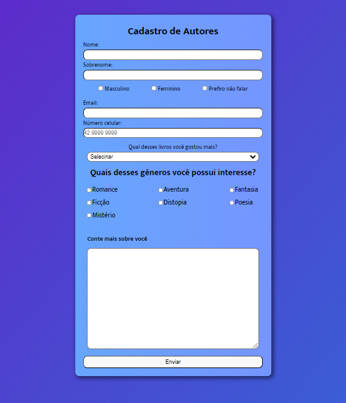

# Lp-Form

This is an formulary created for one producer and book distributor that wants to cadastrate her new writers

[link figma](https://www.figma.com/file/jBWt7M5HMpfxDoEHQVTeyL/Lp-Form?type=design&node-id=0-1&t=iDTQ3K9CKV2LdNkv-0)

## Project Preview

## Description

That is a simple HTML/CSS project that I created to practice HTML form tags. There's no real validation for this form.

However, in the future, I will make changes and explore more of this idea.

## Take a look. I hope you enjoy 😀
